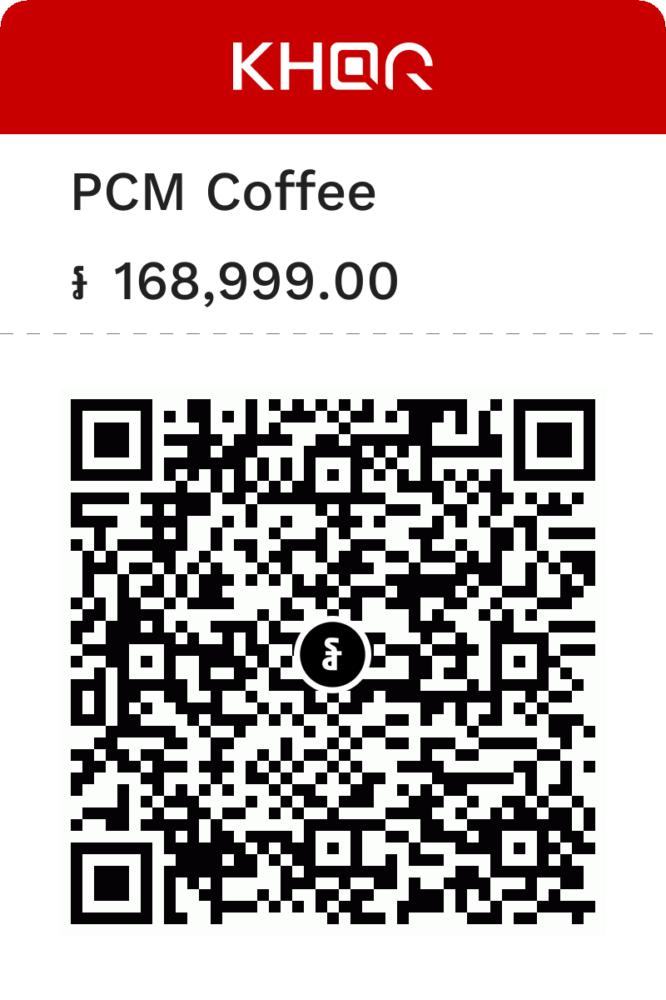
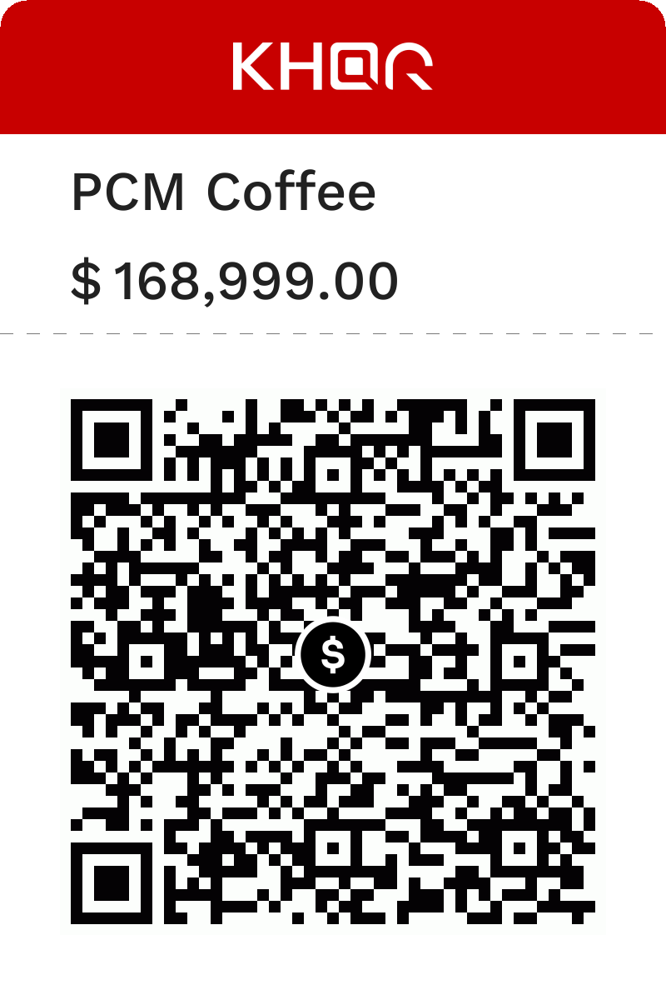

# Bakong KHQR-IMAGE PHP


This is a complete implementation of the [`bakong-khqr`](https://www.npmjs.com/package/bakong-khqr) npm module, including all the available API calls documented here: https://api-bakong.nbc.gov.kh/document.

## Installation

```shell
composer require chamroeuntam/bakong-khqr-image
```

## Usage

All available methods are exposed through the `BakongKHQR` class:

### Generate KHQR for an individual

```php
use KHQR\BakongKHQR;
use KHQR\Helpers\KHQRData;
use KHQR\Models\IndividualInfo;

$individualInfo = new IndividualInfo(
    bakongAccountID: 'chamroeun_tam@wing',
    merchantName: 'Chamroeun Tam',
    merchantCity: 'Siem Reap',
    storeLabel: 'PCM Coffe',
    currency: KHQRData::CURRENCY_KHR,
    amount: 500
);

var_dump(BakongKHQR::generateIndividual($individualInfo));
```

Output:

```shell
object(KHQR\Models\KHQRResponse)#15 (2) {
  ["status"]=>
  array(3) {
    ["code"]=>
    int(0)
    ["errorCode"]=>
    NULL
    ["message"]=>
    NULL
  }
  ["data"]=>
  array(2) {
    ["qr"]=>
    string(119) "00020101021229220018chamroeun_tam@wing520459995303116540710000005802KH5913Chamroeun Tam6010PHNOM PENH9917001317627644609676304198A"
    ["md5"]=>
    string(32) "31becb635939b456ad2d694242cce979"
  }
}
```

### Generate KHQR for a merchant

```php
use KHQR\BakongKHQR;
use KHQR\Models\MerchantInfo;

$merchantInfo = new MerchantInfo(
    bakongAccountID: 'chamroeun_tam@wing',
    merchantName: 'Chamroeun Tam',
    merchantCity: 'Siem Reap',
    merchantID: '123456',
    acquiringBank: 'Mom Bank',
    mobileNumber: '85512345678',
);

var_dump(BakongKHQR::generateMerchant($merchantInfo));
```

Output:

```shell
object(KHQR\Models\KHQRResponse)#19 (2) {
  ["status"]=>
  array(3) {
    ["code"]=>
    int(0)
    ["errorCode"]=>
    NULL
    ["message"]=>
    NULL
  }
  ["data"]=>
  array(2) {
    ["qr"]=>
    string(152) "00020101021130440018chamroeun_tam@wing01061234560208Mom Bank5204599953031165802KH5913Chamroeun Tam6009Siem Reap621502118551234567899170013176276461313963045117"
    ["md5"]=>
    string(32) "dd5b6a1077adfd916e05a3de15cd34d4"
  }
}
```

### Decode KHQR

```php
$result = BakongKHQR::decode('00020101021130440018chamroeun_tam@wing01061234560208Mom Bank5204599953031165802KH5913Chamroeun Tam6009Siem Reap621502118551234567899170013176276461313963045117');

var_dump($result);
```

Output:

```shell
object(KHQR\Models\KHQRResponse)#4 (2) {
  ["status"]=>
  array(3) {
    ["code"]=>
    int(0)
    ["errorCode"]=>
    NULL
    ["message"]=>
    NULL
  }
  ["data"]=>
  array(25) {
    ["merchantType"]=>
    string(2) "30"
    ["bakongAccountID"]=>
    string(18) "chamroeun_tam@wing"
    ["accountInformation"]=>
    NULL
    ["merchantID"]=>
    string(6) "123456"
    ["acquiringBank"]=>
    string(8) "Mom Bank"
    ["billNumber"]=>
    NULL
    ["mobileNumber"]=>
    string(11) "85512345678"
    ["storeLabel"]=>
    NULL
    ["terminalLabel"]=>
    NULL
    ["purposeOfTransaction"]=>
    NULL
    ["languagePreference"]=>
    NULL
    ["merchantNameAlternateLanguage"]=>
    NULL
    ["merchantCityAlternateLanguage"]=>
    NULL
    ["payloadFormatIndicator"]=>
    string(2) "01"
    ["pointofInitiationMethod"]=>
    string(2) "11"
    ["unionPayMerchant"]=>
    NULL
    ["merchantCategoryCode"]=>
    string(4) "5999"
    ["transactionCurrency"]=>
    string(3) "116"
    ["transactionAmount"]=>
    NULL
    ["countryCode"]=>
    string(2) "KH"
    ["merchantName"]=>
    string(13) "Chamroeun Tam"
    ["merchantCity"]=>
    string(9) "Siem Reap"
    ["merchantInformationLanguageTemplate"]=>
    NULL
    ["timestamp"]=>
    string(17) "00131762764613139"
    ["crc"]=>
    string(4) "5117"
  }
}
```

### Verify KHQR

```php
$result = BakongKHQR::verify('00020101021130440018chamroeun_tam@wing01061234560208MomBank5204599953031165802KH5913Chamroeun Tam6009Siem Reap621502118551234567899170013176276461313963045117');

var_dump($result);
```

Output:

```shell
object(KHQR\Models\CRCValidation)#2 (1) {
  ["isValid"]=>
  bool(false)
}
```

### API - Generate KHQR with Deep Link

```php
$sourceInfo = new SourceInfo(
    appIconUrl: 'https://bakong.nbc.gov.kh/images/logo.svg',
    appName: 'Bakong',
    appDeepLinkCallback: 'https://bakong.nbc.gov.kh'
);
$result = BakongKHQR::generateDeepLink('00020101021130440018chamroeun_tam@wing01061234560208MomBank5204599953031165802KH5913Chamroeun Tam6009Siem Reap621502118551234567899170013176276461313963045117', $sourceInfo);

var_dump($result);
```

Output:

```shell
object(KHQR\Models\KHQRResponse)#15 (2) {
  ["status"]=>
  array(3) {
    ["code"]=>
    int(0)
    ["errorCode"]=>
    NULL
    ["message"]=>
    NULL
  }
  ["data"]=>
  object(KHQR\Models\KHQRDeepLinkData)#16 (1) {
    ["shortLink"]=>
    string(34) "https://sit-deeplink.mock/fbf19e2f"
  }
}
```

### API - Check Bakong Account Existence

```php
$result = BakongKHQR::checkBakongAccount('camroeun@devb');

var_dump($result);
```

Output:

```shell
object(KHQR\Models\KHQRResponse)#4 (2) {
  ["status"]=>
  array(3) {
    ["code"]=>
    int(0)
    ["errorCode"]=>
    NULL
    ["message"]=>
    NULL
  }
  ["data"]=>
  array(1) {
    ["bakongAccountExists"]=>
    bool(false)
  }
}
```

### API - Check Transaction Status

A valid token is required to check transaction status. You can get one by registering on the Bakong website: https://api-bakong.nbc.gov.kh/register. At the moment of writing this README the token has to be renewed every 90 days. Then you can create a `BakongKHQR` instance with the token:

```php
$bakongKhqr = new BakongKHQR('eyJhbGciOiJIUzI1NiIsInR5cCI6IkpXVCJ9...');
```

#### Check Transaction by MD5

```php
$response = $bakongKhqr->checkTransactionByMD5('d60f3db96913029a2af979a1662c1e72');
```

#### Check Transaction by MD5 List

```php
$response = $bakongKhqr->checkTransactionByMD5List([
    '0dbe08d3829a8b6b59844e51aa38a4e2',
    '7b0e5c36486d7155eb3ee94997fe9bfb',
    'e12b3ecc4c066405ce05cd8cacab884c',
]);
```

#### Check Transaction by Full Hash

```php
$response = $bakongKhqr->checkTransactionByFullHash('dcd53430d3b3005d9cda36f1fe8dedc3714ccf18f886cf5d090d36fee67ef956');
```

#### Check Transaction by Full Hash List

```php
$response = $bakongKhqr->checkTransactionByFullHashList([
    'f0ae142842181535e678900bc5be1c3bd48d567ced77410a169fb672792968c8',
    'd3b42e35d618a42b7506a79564083e6e91d5383b63f8aa2cf2ca7e65d55ec858',
    '9036688e95cb3d1b621a9a989ebe64629d8c118654cfbc47f4d4991d72fc3b44',
]);
```

#### Check Transaction by Short Hash

```php
$response = $bakongKhqr->checkTransactionByShortHash('8465d722', 1.0, 'USD');
```

#### Check Transaction by Instruction Reference

```php
$response = $bakongKhqr->checkTransactionByInstructionReference('00001234');
```

#### Check Transaction by External Reference

```php
$response = $bakongKhqr->checkTransactionByExternalReference('DEV123456ZTH');
```

### API - Renewing an expired Bakong API Token

If your token has expired, you will get a `KHQRException` when calling authorized Bakong API requests:

```shell
object(KHQR\Exceptions\KHQRException)#51 (7) {
  ["message":protected]=>
  string(57) "Unauthorized, not yet requested for token or code invalid"
  ["string":"Exception":private]=>
  string(0) ""
  ["code":protected]=>
  int(6)
  ...
}
```

You can renew your token with the `renewToken` method:

```php
$result = BakongKHQR::renewToken('chamroeuntam@gmail.com');

var_dump($result);
```

Output:

```shell
array(4) {
  ["responseCode"]=>
  int(0)
  ["responseMessage"]=>
  string(21) "Token has been issued"
  ["errorCode"]=>
  NULL
  ["data"]=>
  array(1) {
    ["token"]=>
    string(172) "eyJhbGciOiJIUzI1NiIsInR5cCI6IkpXVCJ9..."
  }
}
```

In case your email is not registered:

```shell
array(4) {
  ["responseCode"]=>
  int(1)
  ["responseMessage"]=>
  string(18) "Not registered yet"
  ["errorCode"]=>
  int(10)
  ["data"]=>
  NULL
}
```
## KHQR-IMAGE
## KHQR-IMAGE

This library can also render a branded KHQR image (PNG) from the same models you
use to build the payload. There are two primary helpers:

- `BakongKHQR::generateIndividual(IndividualInfo $info)` — returns the KHQR payload string (in a `KHQRResponse`).
- `BakongKHQR::createQrImage(IndividualInfo $info, string $assetsPath = '', int $width = 400, ?bool $embedStoreLabelAsMerchant = null)` — convenience helper that generates the payload and returns a PNG binary.

Quick example (default behaviour)

```php
use KHQR\BakongKHQR;
use KHQR\Helpers\KHQRData;
use KHQR\Models\IndividualInfo;

$individualInfo = new IndividualInfo(
  bakongAccountID: 'chamroeun_tam@wing',
  merchantName: 'Chamroeun Tam',
  merchantCity: 'PHNOM PENH',
  storeLabel: 'PCM Coffee',
  currency: KHQRData::CURRENCY_KHR,
  amount: 168999
);
$qrImage = BakongKHQR::createQrImage($individualInfo);
file_put_contents(__DIR__ . '/khqr_code.png', $qrImage);
echo "QR image saved to khqr_code.png\n";
```
Result QR code
----------------------------------------------------------------
<!-- Inline images with clickable preview and download buttons -->
<div style="display:flex; flex-wrap:wrap; gap:12px; align-items:flex-start;">
  <figure style="margin:0; width:360px; max-width:48%;">
    <a href="assets/khqr_khr.png">
      
    </a>
  </figure>

  <figure style="margin:0; width:360px; max-width:48%;">
    <a href="assets/khqr_usd.png">
      
    </a>
  </figure>
</div>
## Testing

To run the tests:

```shell
composer run test
```

## Static Code Analysis

To run static code analysis:

```shell
composer run stan
```

## Code Style

To run the code style fixer:

```shell
composer run pint
```

## Code Refactoring

```shell
composer run refactor
```

## Troubleshooting

### PHP curl does not work correctly on Windows.

It may be due to the fact that your PHP configuration does not include a valid certificate file. This can be confirmed by disabling the SSL verification:

```php
// ignore the SSL certificate
curl_setopt($curlHandle, CURLOPT_SSL_VERIFYPEER,false);
```

or by checking with `phpinfo()`:

```shell
curl.cainfo => no value => no value
```

If that's true, the certificate file can be downloaded from https://curl.se/ca/cacert.pem, and include in `php.ini` file:

```properties
curl.cainfo = "C:\Users\force\cacert.pem"
```

After that, restart your services or your terminal and retest.
# bakong-khqr-image
